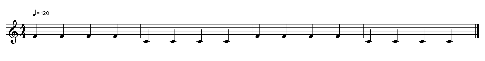
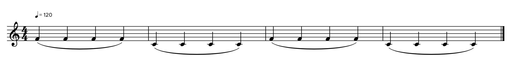
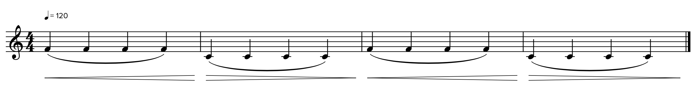

# Playing With MusicXML

## The below score samples were generated via [SOUNDSLICE](https://www.soundslice.com/musicxml-viewer/)

Here's the initial - [view commit](https://github.com/rohanpritchard/playing_with_musicxml/commit/3722a64cb29f4a72939b9e61cad2c4bd5d8dee45):

Now with slurs - [view commit](https://github.com/rohanpritchard/playing_with_musicxml/commit/3dbbde939b13bf6c9180b19c4ad0aab7f38a951b):

Now with dynamics - [view commit](https://github.com/rohanpritchard/playing_with_musicxml/commit/adf999791c33ae05db0d828bca760b8a9a30960b):

